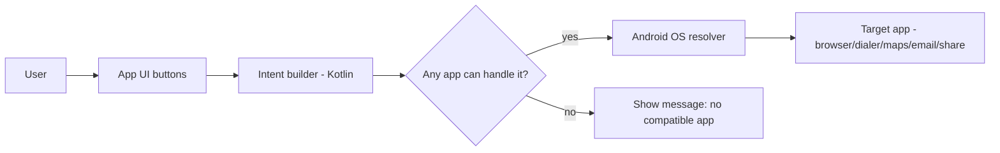

# ImplicitIntentApp 

An Android app (Kotlin) showcasing **implicit intents**—interacting with other apps using Android’s built-in intent system (e.g., open a web page, compose an email, dial a number, open maps, share text).  

---

##  Features

- **Open Web URL** with `ACTION_VIEW`
- **Dial a phone number** with `ACTION_DIAL`
- **Send an email** with `ACTION_SENDTO` and `mailto:`
- **Open Maps / navigation** with geo URIs
- **Share text** with `ACTION_SEND`
- **Safeguards**: checks `resolveActivity` before launching

---

## Tech Stack

- **Language:** Kotlin  
- **Min Android:** API 21+ (recommended)  
- **UI:** Android Views or Jetpack Compose (depending on your project)  
- **Build:** Gradle / Android Studio  
- **Module:** Single Android app module (`app/`)  

> Repo shows a standard Android/Gradle layout with Kotlin as the primary language. :contentReference[oaicite:0]{index=0}

---

##  Permissions

Add only what you actually use (most implicit intents don’t need runtime permissions). Examples:

```xml
<!-- AndroidManifest.xml -->
<uses-permission android:name="android.permission.CALL_PHONE" />
<!-- Only needed if you place direct call with ACTION_CALL (not ACTION_DIAL) -->
```

##  Setup & Run

1. **Clone the repo**
   ```bash
   git clone https://github.com/ananya101001/ImplicitIntentApp.git
   cd ImplicitIntentApp
   ```
2.  Open in Android Studio

   1. Launch **Android Studio**  
   2. Open the project folder  
   3. Let Gradle sync dependencies  


## Run the App

1. Connect a device or start an emulator  
2. Press **Run ▶️** in Android Studio  
3. Test each button to launch the different implicit intents  


<!-- If you show current location in maps, you may add location permissions (optional) -->
<uses-permission android:name="android.permission.ACCESS_FINE_LOCATION" />


## 🏗 Architecture

## 🏗 Architecture


